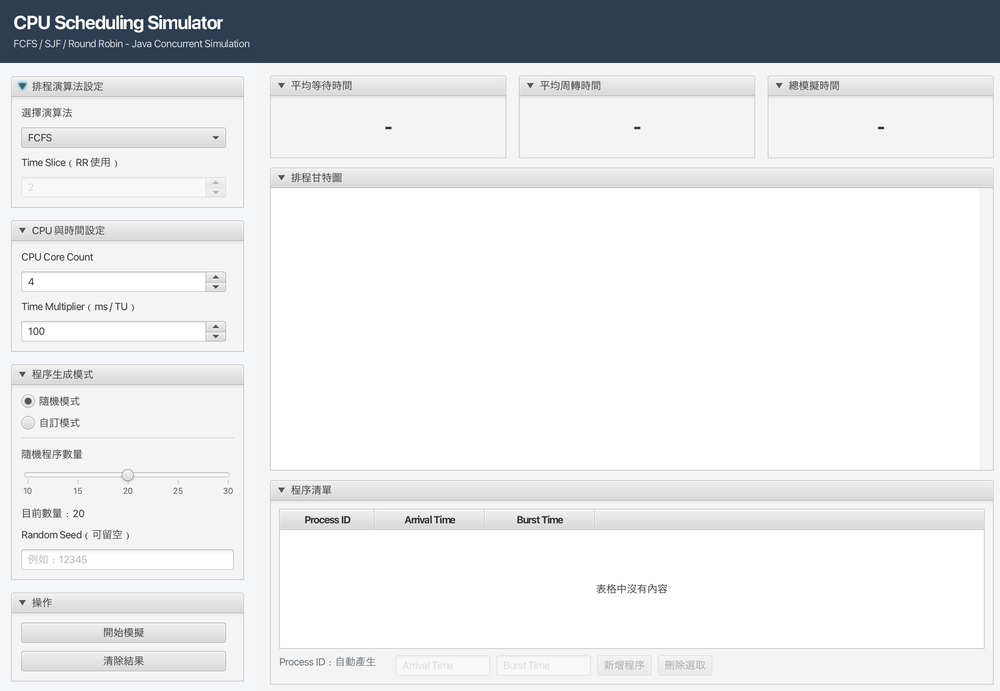
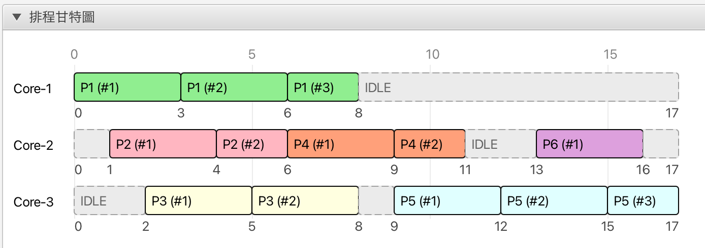
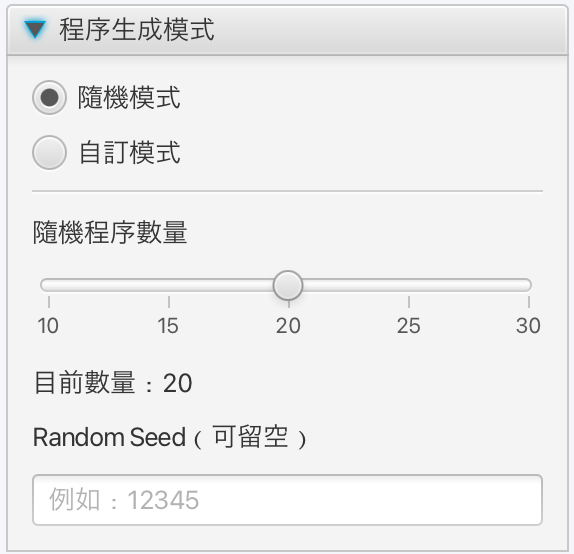
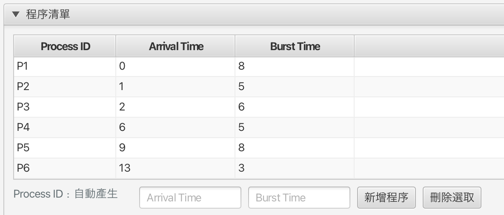

# Multicore CPU Scheduling Simulator

A JavaFX-based multicore CPU scheduling simulator implemented with Java concurrency utilities.

This project simulates classic CPU scheduling algorithms in a multicore environment. It supports custom process input, random process generation, per-core Gantt chart visualization, idle time display, and basic scheduling performance metrics.

> This project focuses on combining operating system scheduling concepts with Java concurrency and JavaFX visualization.

---

## Demo

### Main Application Window



### Gantt Chart Visualization


### Random Process Mode



### Custom Process Mode


---

## Features

* Supports multiple CPU scheduling algorithms:

    * First-Come, First-Served (FCFS)
    * Shortest Job First (SJF)
    * Round Robin (RR)
* Simulates multicore CPU execution using Java concurrency utilities
* Supports configurable CPU core count
* Supports configurable simulation speed
* Supports configurable time slice for Round Robin
* Provides two process generation modes:

    * Custom process input
    * Random process generation
* Supports optional random seed for reproducible simulations
* Displays a per-core Gantt chart
* Shows process execution periods and CPU idle periods
* Displays generated process list for result verification
* Calculates:

    * Average Waiting Time
    * Average Turnaround Time
    * Total Simulation Time

---

## Tech Stack

* Java 21
* JavaFX
* Maven
* Java Concurrency Utilities

    * `ExecutorService`
    * `LinkedBlockingQueue`
    * `PriorityBlockingQueue`
    * `ConcurrentLinkedQueue`
    * `CountDownLatch`

---

## How to Run

This project uses **Maven Wrapper**, so you do not need to install Maven manually.
After cloning the repository, make sure you have **JDK 21 or later** installed.

### 1. Clone the Repository

```bash
git clone <your-repository-url>
cd Multicore-CPU-Scheduling-Simulator
```

### 2. Run the Application

#### macOS / Linux

```bash
./mvnw clean javafx:run
```

#### Windows

```bash
mvnw.cmd clean javafx:run
```

The application will start as a JavaFX desktop application.

---

## System Architecture

### Package Responsibilities

| Package     | Responsibility                                                                   |
| ----------- | -------------------------------------------------------------------------------- |
| `model`     | Domain objects and simulation result data                                        |
| `scheduler` | Scheduling strategy interface and algorithm implementations                      |
| `engine`    | Simulation flow, process generation, CPU core execution, and concurrency control |
| `ui`        | JavaFX application, controller, and Gantt chart visualization                    |

### Execution Flow

```plaintext
JavaFX UI
   ↓
SimulationEngine
   ↓
ProcessGenerator
   ↓
Scheduler / Ready Queue
   ↓
CpuCorePool
   ↓
CpuCore threads
   ↓
EventLog
   ↓
SimulationResult
   ↓
JavaFX Gantt Chart
```

### Main Components

| Component          | Description                                                         |
| ------------------ | ------------------------------------------------------------------- |
| `SimulationEngine` | Coordinates the entire simulation flow                              |
| `ProcessGenerator` | Generates processes based on custom input or random mode            |
| `Scheduler`        | Defines the scheduling strategy interface                           |
| `FCFSScheduler`    | Implements First-Come, First-Served scheduling                      |
| `SJFScheduler`     | Implements non-preemptive Shortest Job First scheduling             |
| `RRScheduler`      | Implements Round Robin scheduling                                   |
| `CpuCorePool`      | Manages simulated CPU core threads using `ExecutorService`          |
| `CpuCore`          | Simulates a CPU core that repeatedly fetches and executes processes |
| `SimulationClock`  | Converts real elapsed time into simulation time units               |
| `EventRecord`      | Records each execution segment for Gantt chart rendering            |
| `SimulationResult` | Stores simulation output, metrics, event log, and process list      |

---

## Supported Scheduling Algorithms

### First-Come, First-Served (FCFS)

FCFS executes processes based on their arrival order.

In this project, FCFS uses a thread-safe ready queue. Once a process enters the ready queue, CPU cores fetch processes in queue order.

---

### Shortest Job First (SJF)

SJF selects the process with the shortest burst time from the ready queue.

The current implementation is non-preemptive SJF. Once a process is selected by a CPU core, it runs until completion.

---

### Round Robin (RR)

Round Robin executes each process for a fixed time slice.

If a process is not completed within its time slice, it is placed back into the ready queue. In a multicore environment, the same process may later be executed by a different CPU core.

This behavior represents a global ready queue design, where all CPU cores fetch work from the same scheduler.

---

## Concurrency Design

This project uses Java concurrency utilities to simulate multicore CPU scheduling.

### CPU Core Simulation

Each simulated CPU core is represented by a `CpuCore` task and executed through an `ExecutorService`.

```plaintext
CpuCorePool
   ├── Core-1
   ├── Core-2
   ├── Core-3
   └── Core-4
```

Each core repeatedly:

1. Fetches the next process from the scheduler
2. Executes the process for a calculated runtime
3. Records an execution event
4. Terminates the process or places it back into the ready queue

---

### Producer-Consumer Model

The simulation follows a producer-consumer style design.

```plaintext
ProcessGenerator  →  Scheduler / Ready Queue  →  CpuCore
```

| Role     | Component                 |
| -------- | ------------------------- |
| Producer | `ProcessGenerator`        |
| Buffer   | `Scheduler` / Ready Queue |
| Consumer | `CpuCore`                 |

The `ProcessGenerator` adds processes to the ready queue according to their arrival time. CPU cores consume processes from the scheduler.

---

### Thread-Safe Data Structures

| Data Structure          | Usage                             |
| ----------------------- | --------------------------------- |
| `LinkedBlockingQueue`   | FCFS and RR ready queue           |
| `PriorityBlockingQueue` | SJF ready queue                   |
| `ConcurrentLinkedQueue` | Event log storage                 |
| `CountDownLatch`        | Waits for all processes to finish |

---

## Gantt Chart Visualization

The JavaFX GUI displays a per-core Gantt chart.

Each CPU core has its own timeline row.

```plaintext
Core-1 | [ P1 ] [ IDLE ] [ P4 ]
Core-2 | [ IDLE ] [ P2 ] [ P3 ]
```

### Visualization Details

* Process execution blocks are displayed with colors
* CPU idle periods are displayed as gray blocks
* Each CPU core has a separate timeline
* Time boundaries are deduplicated to avoid repeated labels
* Tooltips provide detailed process execution information
* Short process blocks still show their process ID

### Idle Time

Idle periods are not stored as actual processes. They are calculated in the UI by detecting gaps between execution records.

This keeps the simulation model clean because `IDLE` is not a real process. It is only a visualization result.

---

## Process Input Modes

### Custom Mode

In custom mode, users manually input:

* Arrival Time
* Burst Time

The system automatically generates process IDs:

```plaintext
P1, P2, P3, ...
```

### Random Mode

In random mode, the system generates processes automatically.

Current random generation rules:

| Field         | Range     |
| ------------- | --------- |
| Arrival Time  | 0 - 20 TU |
| Burst Time    | 1 - 10 TU |
| Process Count | 10 - 30   |

Users may also provide a random seed to reproduce the same process set.

---

## Metrics Calculation

The simulator calculates basic CPU scheduling metrics.

### Turnaround Time

```plaintext
Turnaround Time = Completion Time - Arrival Time
```

### Waiting Time

```plaintext
Waiting Time = Turnaround Time - Burst Time
```

### Average Waiting Time

```plaintext
Average Waiting Time = Total Waiting Time / Number of Processes
```

### Average Turnaround Time

```plaintext
Average Turnaround Time = Total Turnaround Time / Number of Processes
```

---


## Project Structure

```plaintext
Multicore-CPU-Scheduling-Simulator
├── pom.xml
├── README.md
├── src
│   └── main
│       ├── java
│       │   ├── engine
│       │   │   ├── CpuCore.java
│       │   │   ├── CpuCorePool.java
│       │   │   ├── ProcessGenerator.java
│       │   │   ├── SimulationClock.java
│       │   │   └── SimulationEngine.java
│       │   │
│       │   ├── model
│       │   │   ├── EventRecord.java
│       │   │   ├── Process.java
│       │   │   ├── ProcessState.java
│       │   │   ├── SimulationConfig.java
│       │   │   └── SimulationResult.java
│       │   │
│       │   ├── scheduler
│       │   │   ├── Scheduler.java
│       │   │   ├── FCFSScheduler.java
│       │   │   ├── SJFScheduler.java
│       │   │   └── RRScheduler.java
│       │   │
│       │   └── ui
│       │       ├── MainApp.java
│       │       └── MainController.java
│       │
│       └── resources
│           └── ui
│               └── MainView.fxml
```

---

## Design Decisions

### Why is `Process` not implemented as a Java Thread?

In this simulator, a process is treated as a domain object, not an actual Java thread.

The Java threads represent CPU cores, while `Process` only stores scheduling-related data such as arrival time, burst time, remaining time, and completion time.

This design better matches the simulation goal:

```plaintext
CpuCore = executor
Process = task data
```

---

### Why use a `Scheduler` interface?

The `Scheduler` interface allows different scheduling algorithms to be implemented as interchangeable strategies.

```plaintext
Scheduler
├── FCFSScheduler
├── SJFScheduler
└── RRScheduler
```

This makes the system easier to extend with new algorithms such as Priority Scheduling or SRTF.

---

### Why use immutable `EventRecord`?

`EventRecord` represents a completed execution segment.

Once an event is recorded, it should not be modified. This makes it suitable for immutable data representation and Gantt chart rendering.

---

### Why calculate idle time in the UI?

Idle time is not a real process. It is derived from gaps between execution records.

Therefore, the simulator keeps `EventRecord` focused only on real process execution, while the UI calculates idle blocks for visualization.

---

### Why can a process run on different cores?

The simulator uses a global ready queue.

In Round Robin, when a process is not finished after one time slice, it is placed back into the ready queue. Any available CPU core may fetch it later.

This means a process can migrate between cores, which is acceptable in a multicore scheduling simulation.

---

## Future Improvements

* Add unit tests for each scheduling algorithm
* Add integration tests for the simulation engine
* Add Priority Scheduling
* Add Shortest Remaining Time First (SRTF)
* Add process-level result table with waiting time and turnaround time

